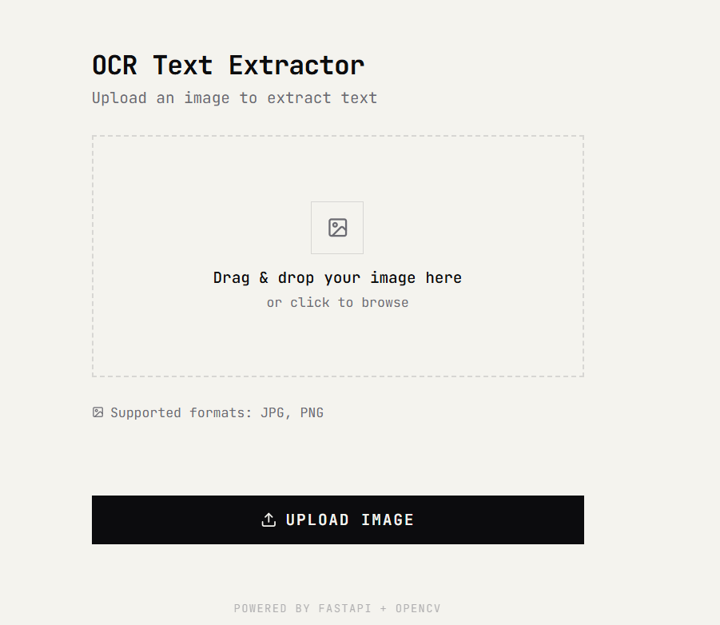
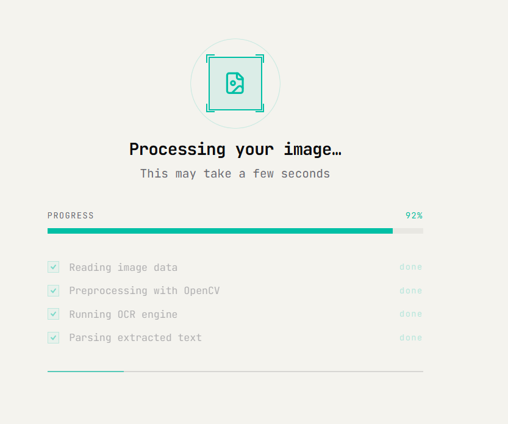
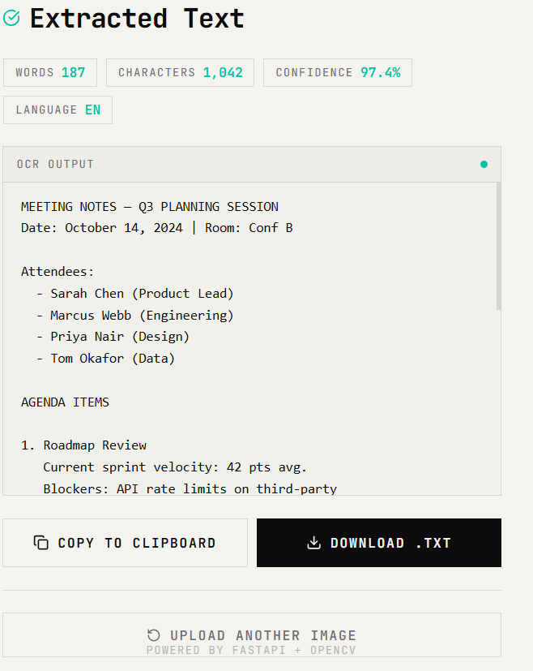

# Wireframes — OCR Web Application

These wireframes represent the main user flow for the OCR application.

## User workflow
1. User opens the app
2. User uploads an image
3. System processes the image
4. OCR result is displayed
5. User copies or downloads the text
6. User optionally switches theme.

## Screens Included
1. **Home Screen**

   - Upload button
   - Drag-and-drop area
   - Theme toggle (light/dark)

2. **Process Screen**

   - Loading indicator
   - Message: "Processing your image..."

3. **Result Screen**

   - Extracted text preview
   - Copy button
   - Download as .txt button

